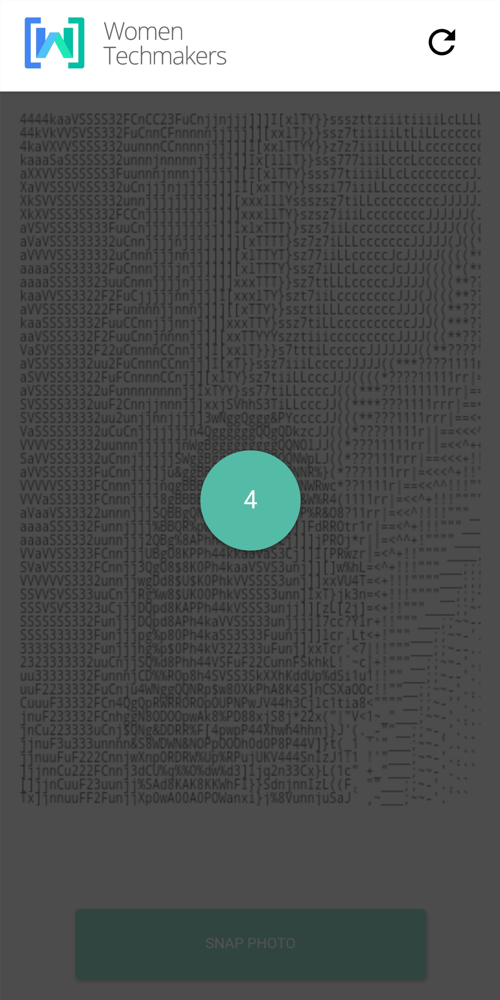

# ASCII Kiosk

Node application meant to run on a Raspberry Pi connected to a Dymo thermal printer. It serves a web application that is meant to run on the Chrome Browser on an Android phone (Pixel 2). The Raspberry Pi is meant to create a local ad hoc network for the Android phone to connect to.

Node application serves a web application page that accesses camera and runs ASCII filter on camera input. The phone is meant to direct browser to a page served on local ad hoc network and save to home page. This allows it to run as a web application that looks like a native application with little installation

User is encouraged to use speech-to-text input to create a quote of a certain maximum length.

Upon taking picture, the web client client takes ASCII filtered image is superimposed with the quote to send to server as an image (either file upload or base64 encode) which then directs to print on the Dymo printer.

# Installation

You'll need at minimum node 8.6.0 + npm 5.3.0 to get the correct dependencies. Otherwise app build will fail/hang. on Raspberry Pi. I suggest installing NVM and installing node 8.6.0.

__For later__:*in order to use dymo on linux, you need the linux labelwriter sdk, then ```yarn add dymo```*

```sh
curl -o- https://raw.githubusercontent.com/creationix/nvm/v0.33.8/install.sh | bash
```
You'll have to restart your terminal for it take effect. Then:
```sh
nvm install node 8.6.0
nvm use node 8.6.0
```

```javascript
$ yarn install
$ yarn build
$ yarn start
```
or

```javascript
$ npm run install
$ npm run build
$ npm run start
```
__Initial install will take quite a bit of time on the Pi__

Do not close the terminal, this is a development version so it'll re-compile every time there is a change to the code. On the phone navigate the address printed at the beginning of the console output ```listening on port ipaddress:port```





